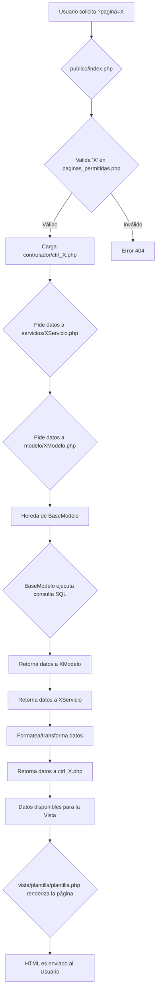

[< Volver al README principal](../README.md)

# Arquitectura del Software

El sistema sigue una arquitectura inspirada en el patrón **Modelo-Vista-Controlador (MVC)**, con una capa adicional de **Servicios** para separar aún más la lógica de negocio. Esta estructura, a veces llamada **MVC-S**, permite un código más limpio, organizado y fácil de mantener.

## Flujo General de una Petición

El siguiente diagrama ilustra cómo viaja una petición a través del sistema, desde que el usuario hace clic en un enlace hasta que la página se renderiza en su navegador.

## Análisis por Directorios

La estructura de directorios es fundamental para entender la organización del código. Cada carpeta tiene una responsabilidad única:

-   `\publico`: Es el directorio raíz del servidor web y el único accesible públicamente. Contiene el punto de entrada `index.php`, así como los assets (CSS, JS, imágenes). Para más detalles, consulta la [documentación de Frontend](./FRONTEND.md).

-   `\controlador`: Contiene los controladores. Cada controlador es responsable de manejar una página específica (ej: `ctrl_autoridades.php` para la página de autoridades). Su función es ser un intermediario: recibe la petición, le pide a la capa de servicios los datos que necesita y finalmente se los pasa a la vista.

-   `\servicios`: Contiene la lógica de negocio de la aplicación. Las clases de servicio orquestan la obtención y transformación de datos, actuando como un puente entre los controladores y los modelos.

-   `\modelo`: Responsable de toda la interacción con la base de datos. Para más detalles, consulta la [documentación de la Base de Datos](./BASE_DE_DATOS.md).

-   `\vista`: Contiene todo el código de presentación (HTML). Se divide en `paginas`, `componentes` y `plantilla`.

## Seguridad en la Arquitectura

La seguridad es un pilar en el diseño de esta aplicación, y la arquitectura contribuye a ella de varias maneras:

1.  **Punto de Entrada Único**: Al forzar que todas las peticiones pasen por `publico/index.php`, se garantiza que ninguna lógica o vista se ejecute directamente. Consulta la [documentación de Enrutamiento](./ENRUTAMIENTO.md) para más detalles.

2.  **Aislamiento del Código Fuente**: El servidor web solo tiene acceso al directorio `\publico`, protegiendo el código fuente de accesos no autorizados.

3.  **Lista Blanca de Páginas**: El uso de `servicios/paginas_permitidas.php` previene ataques de *Directory Traversal*. Consulta la [documentación de Enrutamiento](./ENRUTAMIENTO.md) para ver cómo funciona.