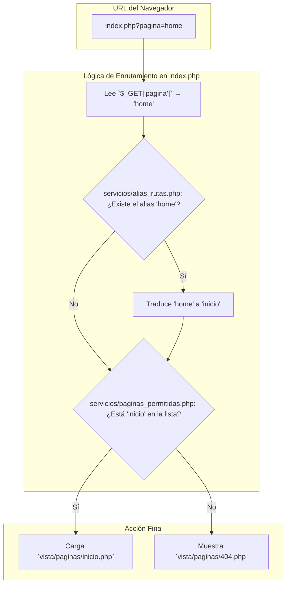

[< Volver al README principal](../README.md)

# Sistema de Enrutamiento

El enrutamiento es gestionado por un único punto de entrada (patrón *Front Controller*), lo que centraliza y simplifica el manejo de las URLs. El archivo responsable es `publico/index.php`. Este enfoque es una parte clave de la [arquitectura de software](./ARQUITECTURA.md) del proyecto.

## Flujo del Enrutamiento

El sistema utiliza un parámetro `GET` llamado `pagina` para determinar qué contenido mostrar.

1.  **URL Amigable (Alias):** El sistema primero revisa si la ruta solicitada es un alias definido en `servicios/alias_rutas.php`. Esto permite tener URLs más limpias como `?pagina=home` que internamente se traduce a `?pagina=inicio`.

2.  **Validación de Página:** Una vez resuelto el alias (o si no existía), el valor de `pagina` se valida contra una lista blanca en `servicios/paginas_permitidas.php`. Este es un paso de seguridad crucial para evitar ataques de inclusión de archivos.

3.  **Carga de Contenido:** Si la página es válida, el `ControladorPlantilla` carga el archivo de la vista correspondiente desde `vista/paginas/{pagina}.php`.

4.  **Error 404:** Si la página no se encuentra en la lista blanca, se muestra una página de error 404.



## Archivos Clave

-   **`publico/index.php`**: El corazón del enrutador. Orquesta la validación y la carga de la página.
-   **`servicios/alias_rutas.php`**: Define un mapa de URLs amigables a los nombres de archivo internos.
-   **`servicios/paginas_permitidas.php`**: Contiene el array (`$paginas_permitidas`) que funciona como lista blanca de seguridad.

## Cómo Añadir una Nueva Página

Para añadir una nueva página, por ejemplo, "eventos", sigue estos pasos:

1.  **Crear el Modelo (si es necesario):** Si la página necesita datos de la base de datos, crea `modelo/paginas/EventosModelo.php`. Consulta la [documentación de la Base de Datos](./BASE_DE_DATOS.md) para más información.

2.  **Crear el Servicio:** Crea `servicios/paginas/EventosServicio.php` para manejar la lógica de negocio.

3.  **Crear el Controlador:** Crea `controlador/ctrl_eventos.php` para conectar el modelo/servicio con la vista.

4.  **Crear la Vista:** Crea el archivo `vista/paginas/eventos.php` con el contenido HTML de la página.

5.  **Actualizar la Lista Blanca:** Añade `'eventos'` al array en `servicios/paginas_permitidas.php`.

    ```php
    // servicios/paginas_permitidas.php
    $paginas_permitidas = [
      "inicio",
      "carreras",
      // ... otras páginas
      "eventos", // <--- Añadir aquí
    ];
    ```

6.  **Añadir un Alias (Opcional):** Si quieres una URL más amigable, añade una entrada en `servicios/alias_rutas.php`.

    ```php
    // servicios/alias_rutas.php
    $alias_rutas = [
      "home" => "inicio",
      // ... otros alias
      "events" => "eventos", // <--- Añadir aquí
    ];
    ```

Ahora, la página será accesible a través de `index.php?pagina=eventos` o `index.php?pagina=events`.