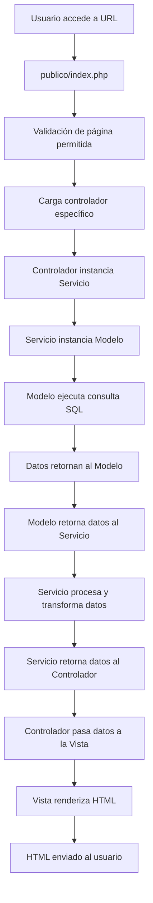

# Análisis Profundo de la Arquitectura MVC-S del Portal UNEXCA

## Resumen Ejecutivo

El Portal Web de la Universidad Nacional Experimental de la Gran Caracas (UNEXCA) implementa una arquitectura **Modelo-Vista-Controlador-Servicio (MVC-S)** que separa claramente las responsabilidades del código, facilitando el mantenimiento, la escalabilidad y la seguridad. Esta arquitectura va más allá del patrón MVC tradicional al incluir una capa de servicios que actúa como intermediario entre los controladores y los modelos.

## Arquitectura General

### Patrón MVC-S Explicado

La arquitectura MVC-S extiende el patrón MVC tradicional con una capa adicional de **Servicios** que encapsula la lógica de negocio compleja. Esta separación permite:

- **Modelos**: Solo se encargan del acceso a datos
- **Servicios**: Contienen la lógica de negocio y transformación de datos
- **Controladores**: Actúan como intermediarios entre la vista y los servicios
- **Vistas**: Solo se encargan de la presentación

### Flujo de Datos Detallado



## Análisis por Capas

### 1. Capa de Presentación (Vista)

**Ubicación**: `vista/`

**Responsabilidades**:
- Renderizar la interfaz de usuario
- Mostrar datos proporcionados por los controladores
- Manejar la estructura HTML y componentes reutilizables

**Estructura**:
```
vista/
├── componentes/          # Componentes reutilizables
│   ├── renderizar_header.php
│   ├── renderizar_footer.php
│   ├── renderizar_carreras.php
│   └── ...
├── paginas/             # Vistas específicas de páginas
│   ├── inicio.php
│   ├── carrera.php
│   ├── autoridades.php
│   └── ...
└── plantilla/           # Plantilla base
    └── plantilla.php
```

**Características Técnicas**:
- Uso de funciones de renderizado modulares
- Sistema de componentes reutilizables
- Separación clara entre lógica y presentación
- Integración con el sistema de rutas dinámicas

### 2. Capa de Control (Controladores)

**Ubicación**: `controlador/`

**Responsabilidades**:
- Recibir peticiones del usuario
- Coordinar la obtención de datos
- Preparar datos para la vista
- Manejar la lógica de flujo de la aplicación

**Estructura**:
```
controlador/
├── ctrl_inicio.php
├── ctrl_carrera.php
├── ctrl_autoridades.php
├── ctrl_plantilla.php
└── ...
```

**Patrón de Implementación**:
```php
<?php
require_once colocar_ruta_sistema('@servicios/paginas/InicioServicio.php');

$servicio = new InicioServicio();
$data_carrera = $servicio->obtenerDatosCarreras();

$head_data = [
    "title" => "Inicio - UNEXCA",
    "styles" => ["@estilos/paginas/inicio.css"],
    "meta" => [
        "description" => "Página de inicio de la UNEXCA.",
        "keywords" => "UNEXCA, universidad, inicio",
    ]
];
```

### 3. Capa de Servicios

**Ubicación**: `servicios/`

**Responsabilidades**:
- Implementar la lógica de negocio
- Transformar y procesar datos
- Coordinar múltiples modelos si es necesario
- Aplicar reglas de negocio específicas

**Estructura**:
```
servicios/
├── paginas/             # Servicios específicos de páginas
│   ├── InicioServicio.php
│   ├── CarrerasServicio.php
│   └── ...
├── plantilla/           # Servicios de plantilla
│   └── PlantillaServicio.php
├── utilidades.php      # Funciones de utilidad
├── alias_rutas.php      # Sistema de rutas
└── paginas_permitidas.php # Lista blanca de seguridad
```

**Ejemplo de Implementación**:
```php
class InicioServicio
{
    private $modelo_inicio;

    public function __construct()
    {
        $this->modelo_inicio = new InicioModelo();
    }

    public function obtenerDatosCarreras()
    {
        $carreras_lista = $this->modelo_inicio->obtenerCarrerasSimples();
        $carreras_array = [];

        foreach ($carreras_lista as $carrera) {
            $link_carrera = colocar_enlace('carrera', ['nombre' => $carrera['slug']]);
            $carreras_array[] = [
                "titulo"       => $carrera['titulo'],
                "descripcion"  => $carrera['descripcion'],
                "links"        => $link_carrera,
                "img"          => $carrera['imagen'],
            ];
        }

        return $carreras_array;
    }
}
```

### 4. Capa de Datos (Modelos)

**Ubicación**: `modelo/`

**Responsabilidades**:
- Acceso a la base de datos
- Ejecución de consultas SQL
- Validación de datos de entrada
- Manejo de transacciones

**Estructura**:
```
modelo/
├── BaseModelo.php           # Clase base con funcionalidad común
├── conexiondb.php          # Configuración de conexión
├── paginas/                # Modelos específicos
│   ├── InicioModelo.php
│   ├── CarrerasModelo.php
│   └── ...
└── plantilla/
    └── PlantillaModelo.php
```

**Clase BaseModelo**:
```php
class BaseModelo {
    private $pdo;
    private $tablasPermitidas = [
        'autoridades_academicas',
        'carrera',
        'carrera_niveles_academicos',
        // ... más tablas
    ];

    public function __construct() {
        $this->pdo = conectarBD();
    }

    public function obtenerTodos($tabla) {
        $this->validarTabla($tabla);
        $query = "SELECT * FROM {$tabla}";
        $stmt = $this->pdo->prepare($query);
        $stmt->execute();
        return $stmt->fetchAll(PDO::FETCH_ASSOC);
    }

    // ... más métodos CRUD
}
```

## Sistema de Enrutamiento

### Front Controller Pattern

El sistema implementa el patrón **Front Controller** a través de `publico/index.php`, que actúa como punto de entrada único para todas las peticiones.

**Flujo de Enrutamiento**:
1. **Validación de Alias**: Se verifica si la página solicitada tiene un alias en `alias_rutas.php`
2. **Lista Blanca**: Se valida que la página esté en `paginas_permitidas.php`
3. **Carga de Controlador**: Se carga el controlador específico
4. **Renderizado**: Se incluye la vista correspondiente

### Sistema de Rutas Dinámicas

```php
// alias_rutas.php
return [
    'sistema' => [
        '@componentes' => dirname(__DIR__) . '/vista/componentes',
        '@controlador' => dirname(__DIR__) . '/controlador',
        '@estilos'     => dirname(__DIR__) . '/publico/estilos',
        // ... más rutas
    ],
    'html' => [
        '@estilos'     => '/estilos',
        '@imagenes'    => '/imagenes',
        '@scripts'     => '/scripts',
    ]
];
```

## Seguridad en la Arquitectura

### 1. Punto de Entrada Único
- Todas las peticiones pasan por `publico/index.php`
- Protección contra acceso directo a archivos del sistema

### 2. Lista Blanca de Páginas
```php
// paginas_permitidas.php
return $paginas_permitidas = [
    'inicio' => 'inicio.php',
    'historia' => 'historia.php',
    'autoridades' => 'autoridades.php',
    // ... más páginas permitidas
];
```

### 3. Validación de Tablas
```php
private function validarTabla($tabla) {
    if (!in_array($tabla, $this->tablasPermitidas)) {
        throw new Exception("Tabla '$tabla' no permitida.");
    }
}
```

### 4. Aislamiento del Código Fuente
- Solo el directorio `publico/` es accesible desde el servidor web
- El código fuente está protegido contra accesos no autorizados

## Ventajas de la Arquitectura MVC-S

### 1. **Separación de Responsabilidades**
- Cada capa tiene una responsabilidad específica y bien definida
- Facilita el mantenimiento y la evolución del código

### 2. **Reutilización de Código**
- Los servicios pueden ser reutilizados por múltiples controladores
- Los componentes de vista son modulares y reutilizables

### 3. **Testabilidad**
- Cada capa puede ser probada de forma independiente
- Los servicios pueden ser mockeados para pruebas unitarias

### 4. **Escalabilidad**
- Fácil agregar nuevas funcionalidades sin afectar el código existente
- La arquitectura soporta el crecimiento del proyecto

### 5. **Seguridad**
- Múltiples capas de validación y seguridad
- Control estricto sobre el acceso a datos y funcionalidades

## Consideraciones Técnicas

### Rendimiento
- Uso de PDO para conexiones eficientes a la base de datos
- Sistema de rutas optimizado con caché estático
- Separación de assets estáticos y dinámicos

### Mantenibilidad
- Código bien estructurado y documentado
- Patrones de nomenclatura consistentes
- Separación clara entre lógica y presentación

### Extensibilidad
- Fácil agregar nuevas páginas siguiendo el patrón establecido
- Sistema de componentes permite reutilización
- Arquitectura preparada para futuras funcionalidades

## Conclusión

La arquitectura MVC-S implementada en el Portal UNEXCA representa una solución robusta y escalable que separa eficientemente las responsabilidades del código. Esta estructura no solo facilita el mantenimiento y desarrollo, sino que también proporciona una base sólida para futuras expansiones del sistema.

La implementación demuestra buenas prácticas de desarrollo web, incluyendo seguridad, modularidad y reutilización de código, lo que la convierte en un ejemplo sólido de arquitectura web moderna.
