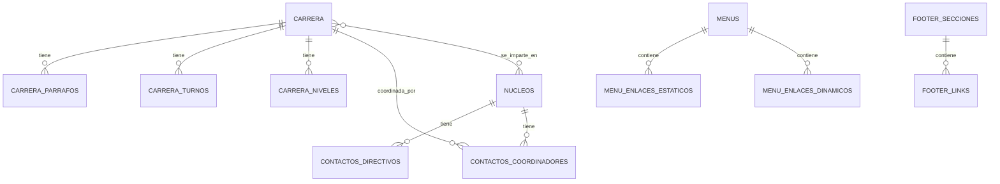

# Análisis Profundo de la Base de Datos del Portal UNEXCA

## Resumen Ejecutivo

El Portal Web de la UNEXCA utiliza **PostgreSQL** como sistema de gestión de base de datos, implementando un esquema relacional bien estructurado que soporta todas las funcionalidades del portal. La base de datos está diseñada para ser escalable, mantenible y segura, con relaciones bien definidas entre entidades y un sistema robusto de gestión de datos.

## Arquitectura de la Base de Datos

### Sistema de Gestión
- **SGBD**: PostgreSQL
- **Versión Recomendada**: 12.0 o superior
- **Conexión**: PDO con driver `pgsql`
- **Configuración**: Variables de entorno para seguridad

### Configuración de Conexión

```php
// modelo/conexiondb.php
function conectarBD() {
    $host     = $_ENV['DB_HOST'] ?? 'localhost';
    $puerto   = $_ENV['DB_PORT'] ?? '5432';
    $nombredb = $_ENV['DB_NAME'] ?? '';
    $usuario  = $_ENV['DB_USER'] ?? '';
    $clave    = $_ENV['DB_PASS'] ?? '';

    if (!$nombredb || !$usuario) {
        die("Error: variables de entorno de la base de datos no están definidas.");
    }

    $dsn = "pgsql:host=$host;port=$puerto;dbname=$nombredb";

    try {
        $pdo = new PDO($dsn, $usuario, $clave, [
            PDO::ATTR_ERRMODE => PDO::ERRMODE_EXCEPTION
        ]);
        return $pdo;
    } catch (PDOException $e) {
        die("Error de conexión: " . $e->getMessage());
    }
}
```

## Esquema de Base de Datos

### Entidades Principales

#### 1. **Núcleos Universitarios**
```sql
CREATE TABLE nucleos (
  id SERIAL PRIMARY KEY,
  nombre VARCHAR(255) NOT NULL
);
```

**Propósito**: Almacena información sobre los diferentes núcleos de la universidad.

**Relaciones**:
- Referenciado por `contactos_directivos.nucleo_id`
- Referenciado por `contactos_coordinadores_pnf.nucleo_id`
- Relación many-to-many con `carrera` a través de `carrera_nucleos`

#### 2. **Carreras Académicas**
```sql
CREATE TABLE carrera (
  id SERIAL PRIMARY KEY,
  titulo VARCHAR(255) NOT NULL,
  descripcion TEXT,
  link_malla_curricular VARCHAR(500),
  imagen VARCHAR(500)
);
```

**Propósito**: Almacena información sobre las carreras ofrecidas por la universidad.

**Relaciones**:
- One-to-many con `carrera_parrafos`
- One-to-many con `carrera_turnos`
- One-to-many con `carrera_niveles_academicos`
- Many-to-many con `nucleos` a través de `carrera_nucleos`
- Referenciado por `contactos_coordinadores_pnf.carrera_id`

#### 3. **Contactos Directivos**
```sql
CREATE TABLE contactos_directivos (
  id SERIAL PRIMARY KEY,
  nombre_completo VARCHAR(255) NOT NULL,
  cargo VARCHAR(255) NOT NULL,
  telefono VARCHAR(50),
  email VARCHAR(255),
  oficina TEXT,
  nucleo_id INTEGER REFERENCES nucleos(id) ON DELETE CASCADE
);
```

**Propósito**: Información de contacto de las autoridades directivas de cada núcleo.

#### 4. **Contactos Coordinadores PNF**
```sql
CREATE TABLE contactos_coordinadores_pnf (
  id SERIAL PRIMARY KEY,
  nombre_completo VARCHAR(255) NOT NULL,
  titulo_academico VARCHAR(100),
  telefono VARCHAR(50),
  email VARCHAR(255),
  oficina TEXT,
  horario_atencion TEXT,
  nucleo_id INTEGER REFERENCES nucleos(id) ON DELETE SET NULL,
  carrera_id INTEGER REFERENCES carrera(id) ON DELETE CASCADE
);
```

**Propósito**: Información de contacto de los coordinadores de Programas Nacionales de Formación (PNF).

### Entidades de Soporte

#### 5. **Párrafos de Carreras**
```sql
CREATE TABLE carrera_parrafos (
  id SERIAL PRIMARY KEY,
  carrera_id INT NOT NULL,
  numero_parrafo INT,
  contenido TEXT,
  FOREIGN KEY (carrera_id) REFERENCES carrera(id) ON DELETE CASCADE
);
```

**Propósito**: Permite almacenar múltiples párrafos de descripción para cada carrera.

#### 6. **Turnos de Carreras**
```sql
CREATE TABLE carrera_turnos (
  id SERIAL PRIMARY KEY,
  carrera_id INT NOT NULL,
  turno VARCHAR(100),
  FOREIGN KEY (carrera_id) REFERENCES carrera(id) ON DELETE CASCADE
);
```

**Propósito**: Define los turnos disponibles para cada carrera (matutino, vespertino, nocturno).

#### 7. **Niveles Académicos de Carreras**
```sql
CREATE TABLE carrera_niveles_academicos (
  id SERIAL PRIMARY KEY,
  carrera_id INTEGER NOT NULL REFERENCES carrera(id) ON DELETE CASCADE,
  nivel VARCHAR(50) NOT NULL,
  duracion VARCHAR(100) NOT NULL,
  diploma VARCHAR(255) NOT NULL
);
```

**Propósito**: Define los diferentes niveles académicos que puede tener una carrera (TSU, Licenciatura, etc.).

#### 8. **Relación Carrera-Núcleos**
```sql
CREATE TABLE carrera_nucleos (
  id SERIAL PRIMARY KEY,
  carrera_id INT NOT NULL REFERENCES carrera(id) ON DELETE CASCADE,
  nucleo_id INT NOT NULL REFERENCES nucleos(id) ON DELETE CASCADE
);
```

**Propósito**: Establece relación many-to-many entre carreras y núcleos.

### Entidades de Contenido

#### 9. **Autoridades Académicas**
```sql
CREATE TABLE autoridades_academicas (
  id SERIAL PRIMARY KEY,
  nombre VARCHAR(255) NOT NULL,
  cargo VARCHAR(255) NOT NULL,
  imagen VARCHAR(500)
);
```

**Propósito**: Información sobre las autoridades académicas de la universidad.

#### 10. **Preguntas Frecuentes (FAQs)**
```sql
CREATE TABLE faqs (
  id SERIAL PRIMARY KEY,
  pregunta TEXT NOT NULL,
  respuesta TEXT NOT NULL
);
```

**Propósito**: Sistema de preguntas frecuentes para usuarios.

#### 11. **Servicios**
```sql
CREATE TABLE servicios (
  id SERIAL PRIMARY KEY,
  servicio TEXT NOT NULL,
  respuesta TEXT NOT NULL
);
```

**Propósito**: Información sobre los servicios ofrecidos por la universidad.

### Sistema de Navegación

#### 12. **Enlaces del Header**
```sql
CREATE TABLE header_links (
  id SERIAL PRIMARY KEY,
  titulo VARCHAR(255) NOT NULL,
  url VARCHAR(500),
  id_padre INTEGER REFERENCES header_links(id) ON DELETE CASCADE
);
```

**Propósito**: Sistema jerárquico de navegación para el header del sitio.

#### 13. **Secciones del Footer**
```sql
CREATE TABLE footer_secciones (
  id SERIAL PRIMARY KEY,
  titulo VARCHAR(255) NOT NULL
);
```

#### 14. **Enlaces del Footer**
```sql
CREATE TABLE footer_links (
  id SERIAL PRIMARY KEY,
  texto VARCHAR(255) NOT NULL,
  url VARCHAR(500) NOT NULL,
  seccion_id INTEGER REFERENCES footer_secciones(id) ON DELETE CASCADE
);
```

### Sistema de Menús Dinámicos

#### 15. **Menús**
```sql
CREATE TABLE menus (
  id SERIAL PRIMARY KEY,
  nombre VARCHAR(255) NOT NULL
);
```

#### 16. **Enlaces Estáticos del Menú**
```sql
CREATE TABLE menu_enlaces_estaticos (
  id SERIAL PRIMARY KEY,
  menu_id INTEGER NOT NULL REFERENCES menus(id) ON DELETE CASCADE,
  titulo VARCHAR(255) NOT NULL,
  url VARCHAR(500),
  padre_id INTEGER REFERENCES menu_enlaces_estaticos(id) ON DELETE CASCADE,
  orden INTEGER DEFAULT 0
);
```

#### 17. **Enlaces Dinámicos del Menú**
```sql
CREATE TABLE menu_enlaces_dinamicos (
  id SERIAL PRIMARY KEY,
  menu_id INTEGER NOT NULL REFERENCES menus(id) ON DELETE CASCADE,
  titulo VARCHAR(255) NOT NULL,
  url VARCHAR(500),
  tabla_origen VARCHAR(100),
  registro_id INTEGER,
  padre_id INTEGER REFERENCES menu_enlaces_estaticos(id) ON DELETE CASCADE,
  orden INTEGER DEFAULT 0
);
```

## Análisis de Relaciones

### Diagrama de Relaciones Principales



### Relaciones Críticas

1. **Carrera-Núcleos**: Relación many-to-many que permite que una carrera se imparta en múltiples núcleos
2. **Contactos-Carreras**: Los coordinadores están asociados a carreras específicas
3. **Menús Jerárquicos**: Sistema de menús con soporte para submenús
4. **Contenido Dinámico**: Las carreras pueden tener múltiples párrafos, turnos y niveles

## Patrones de Acceso a Datos

### Clase BaseModelo

La clase `BaseModelo` implementa el patrón **Active Record** y proporciona funcionalidad CRUD básica:

```php
class BaseModelo {
    private $pdo;
    private $tablasPermitidas = [
        'autoridades_academicas',
        'carrera',
        'carrera_niveles_academicos',
        // ... más tablas
    ];

    public function obtenerTodos($tabla) {
        $this->validarTabla($tabla);
        $query = "SELECT * FROM {$tabla}";
        $stmt = $this->pdo->prepare($query);
        $stmt->execute();
        return $stmt->fetchAll(PDO::FETCH_ASSOC);
    }

    public function obtenerPorId($tabla, $id) {
        $this->validarTabla($tabla);
        $query = "SELECT * FROM {$tabla} WHERE id = :id";
        $stmt = $this->pdo->prepare($query);
        $stmt->execute(['id' => $id]);
        return $stmt->fetch(PDO::FETCH_ASSOC);
    }

    public function insertar($tabla, $data) {
        $this->validarTabla($tabla);
        $columnas = implode(', ', array_keys($data));
        $valores = ':' . implode(', :', array_keys($data));
        $query = "INSERT INTO {$tabla} ($columnas) VALUES ($valores)";
        $stmt = $this->pdo->prepare($query);
        return $stmt->execute($data);
    }

    public function actualizar($tabla, $data, $id) {
        $this->validarTabla($tabla);
        $camposArray = [];
        foreach ($data as $columna => $valor) {
            $camposArray[] = "$columna = :$columna";
        }
        $campos = implode(', ', $camposArray);
        $data['id'] = $id;

        $query = "UPDATE {$tabla} SET $campos WHERE id = :id";
        $stmt = $this->pdo->prepare($query);
        return $stmt->execute($data);
    }

    public function eliminar($tabla, $id) {
        $this->validarTabla($tabla);
        $query = "DELETE FROM {$tabla} WHERE id = :id";
        $stmt = $this->pdo->prepare($query);
        return $stmt->execute(['id' => $id]);
    }

    public function ejecutarConsultaPersonalizada($sql, $params = []) {
        $stmt = $this->pdo->prepare($sql);
        $stmt->execute($params);
        return $stmt->fetchAll(PDO::FETCH_ASSOC);
    }
}
```

### Consultas Especializadas

#### Consulta Jerárquica de Menús
```php
public function obtenerEnlacesJerarquicos($menu_id) {
    $sql = "SELECT 
                p.id          AS padre_id,
                p.titulo      AS padre_titulo,
                p.url         AS padre_url,
                h.id          AS hijo_id,
                h.titulo      AS hijo_titulo,
                h.url         AS hijo_url
            FROM menu_enlaces_estaticos p
            LEFT JOIN menu_enlaces_estaticos h 
                   ON h.padre_id = p.id
            WHERE p.menu_id = :menu_id
              AND p.padre_id IS NULL
            ORDER BY p.orden ASC, h.orden ASC";
    $enlaces_estaticos = $this->ejecutarConsultaPersonalizada($sql, ['menu_id' => $menu_id]);

    $sql = "SELECT id, titulo, url, tabla_origen, registro_id, padre_id, orden 
            FROM menu_enlaces_dinamicos 
            WHERE menu_id = :menu_id
            ORDER BY orden ASC";
    $enlaces_dinamicos = $this->ejecutarConsultaPersonalizada($sql, ['menu_id' => $menu_id]);

    return [
        'estaticos' => $enlaces_estaticos,
        'dinamicos' => $enlaces_dinamicos
    ];
}
```

## Seguridad de la Base de Datos

### 1. **Prepared Statements**
- Todas las consultas utilizan prepared statements
- Protección contra inyección SQL
- Validación automática de tipos de datos

### 2. **Lista Blanca de Tablas**
```php
private $tablasPermitidas = [
    'autoridades_academicas',
    'carrera',
    'carrera_niveles_academicos',
    // ... solo tablas permitidas
];

private function validarTabla($tabla) {
    if (!in_array($tabla, $this->tablasPermitidas)) {
        throw new Exception("Tabla '$tabla' no permitida.");
    }
}
```

### 3. **Variables de Entorno**
- Credenciales almacenadas en variables de entorno
- Separación entre configuración y código
- Protección contra exposición accidental de credenciales

### 4. **Integridad Referencial**
- Uso de claves foráneas con restricciones
- Cascada de eliminación controlada
- Validación de relaciones en el nivel de base de datos

## Optimizaciones de Rendimiento

### 1. **Índices Recomendados**
```sql
-- Índices para búsquedas frecuentes
CREATE INDEX idx_carrera_titulo ON carrera(titulo);
CREATE INDEX idx_contactos_nucleo ON contactos_directivos(nucleo_id);
CREATE INDEX idx_contactos_carrera ON contactos_coordinadores_pnf(carrera_id);
CREATE INDEX idx_menu_enlaces_menu ON menu_enlaces_estaticos(menu_id);
```

### 2. **Consultas Optimizadas**
- Uso de JOINs eficientes
- Limitación de resultados cuando sea apropiado
- Consultas específicas en lugar de SELECT *

### 3. **Conexiones PDO**
- Reutilización de conexiones
- Configuración optimizada de PDO
- Manejo eficiente de errores

## Consideraciones de Escalabilidad

### 1. **Particionamiento**
- Las tablas grandes pueden ser particionadas por núcleo
- Separación lógica de datos por funcionalidad

### 2. **Caché**
- Implementación de caché para consultas frecuentes
- Caché de menús y contenido estático

### 3. **Backup y Recuperación**
- Estrategias de backup regulares
- Procedimientos de recuperación documentados

## Monitoreo y Mantenimiento

### 1. **Logs de Base de Datos**
- Monitoreo de consultas lentas
- Análisis de rendimiento
- Detección de problemas de concurrencia

### 2. **Mantenimiento Preventivo**
- Actualización de estadísticas
- Limpieza de datos obsoletos
- Optimización de índices

## Conclusión

La base de datos del Portal UNEXCA está diseñada con principios sólidos de ingeniería de software, implementando:

- **Arquitectura relacional bien estructurada**
- **Seguridad robusta con múltiples capas de protección**
- **Escalabilidad y mantenibilidad**
- **Optimización de rendimiento**

Esta estructura proporciona una base sólida para el crecimiento futuro del portal y garantiza la integridad y seguridad de los datos institucionales.
