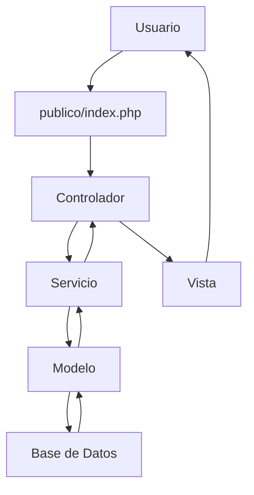

# Guía Completa para Desarrolladores - Portal UNEXCA

## Resumen Ejecutivo

Esta guía proporciona información técnica detallada para desarrolladores que trabajen en el Portal Web de la UNEXCA. Incluye patrones de desarrollo, convenciones de código, arquitectura del sistema, y mejores prácticas para el mantenimiento y extensión del proyecto.

## Requisitos del Entorno de Desarrollo

### Tecnologías Requeridas
- **PHP**: 7.4 o superior
- **PostgreSQL**: 12.0 o superior
- **Servidor Web**: Apache 2.4+ o Nginx 1.18+
- **Git**: Para control de versiones
- **Composer**: Para gestión de dependencias (opcional)

### Herramientas Recomendadas
- **IDE**: Visual Studio Code, PhpStorm, o similar
- **Base de Datos**: pgAdmin 4 o DBeaver
- **Servidor Local**: XAMPP, WAMP, o Docker
- **Control de Versiones**: Git con GitHub/GitLab

## Arquitectura del Sistema

### Patrón MVC-S Implementado

El sistema utiliza una arquitectura **Modelo-Vista-Controlador-Servicio** que separa claramente las responsabilidades:



### Flujo de Desarrollo

1. **Nueva Página**: Crear controlador → servicio → modelo → vista
2. **Nueva Funcionalidad**: Extender servicio existente o crear nuevo
3. **Nuevo Componente**: Crear en `vista/componentes/`
4. **Nuevo Estilo**: Agregar a `publico/estilos/`

## Convenciones de Código

### Nomenclatura de Archivos

#### Controladores
```
controlador/ctrl_[nombre].php
```
**Ejemplo**: `ctrl_inicio.php`, `ctrl_carrera.php`

#### Servicios
```
servicios/paginas/[Nombre]Servicio.php
```
**Ejemplo**: `InicioServicio.php`, `CarrerasServicio.php`

#### Modelos
```
modelo/paginas/[Nombre]Modelo.php
```
**Ejemplo**: `InicioModelo.php`, `CarrerasModelo.php`

#### Vistas
```
vista/paginas/[nombre].php
```
**Ejemplo**: `inicio.php`, `carrera.php`

### Nomenclatura de Clases

```php
// Servicios
class InicioServicio {
    // Métodos públicos para lógica de negocio
}

// Modelos
class InicioModelo extends BaseModelo {
    // Métodos específicos de acceso a datos
}
```

### Nomenclatura de Variables

```php
// Variables en camelCase
$dataCarrera = $servicio->obtenerDatosCarreras();
$headData = [
    "title" => "Inicio - UNEXCA",
    "styles" => ["@estilos/paginas/inicio.css"]
];

// Arrays asociativos descriptivos
$carrerasArray = [];
$enlacesEstaticos = [];
```

## Estructura de Desarrollo

### 1. Crear una Nueva Página

#### Paso 1: Definir la Página
```php
// servicios/paginas_permitidas.php
return $paginas_permitidas = [
    'inicio' => 'inicio.php',
    'historia' => 'historia.php',
    'nueva-pagina' => 'nueva_pagina.php', // ← Agregar aquí
];
```

#### Paso 2: Crear el Controlador
```php
<?php
// controlador/ctrl_nueva-pagina.php
require_once colocar_ruta_sistema('@servicios/paginas/NuevaPaginaServicio.php');

$servicio = new NuevaPaginaServicio();
$data = $servicio->obtenerDatos();

$head_data = [
    "title" => "Nueva Página - UNEXCA",
    "styles" => [
        "@estilos/paginas/nueva_pagina.css"
    ],
    "meta" => [
        "description" => "Descripción de la nueva página",
        "keywords" => "UNEXCA, nueva, página",
    ]
];
```

#### Paso 3: Crear el Servicio
```php
<?php
// servicios/paginas/NuevaPaginaServicio.php
require_once colocar_ruta_sistema('@modelo/paginas/NuevaPaginaModelo.php');

class NuevaPaginaServicio
{
    private $modelo;

    public function __construct()
    {
        $this->modelo = new NuevaPaginaModelo();
    }

    public function obtenerDatos()
    {
        $datos = $this->modelo->obtenerTodosLosDatos();
        
        // Procesar y transformar datos
        $resultado = [];
        foreach ($datos as $item) {
            $resultado[] = [
                'titulo' => $item['titulo'],
                'descripcion' => $item['descripcion'],
                'enlace' => colocar_enlace('detalle', ['id' => $item['id']])
            ];
        }

        return $resultado;
    }
}
```

#### Paso 4: Crear el Modelo
```php
<?php
// modelo/paginas/NuevaPaginaModelo.php
require_once colocar_ruta_sistema('@modelo/BaseModelo.php');

class NuevaPaginaModelo extends BaseModelo
{
    public function obtenerTodosLosDatos()
    {
        return $this->obtenerTodos('tabla_relevante');
    }

    public function obtenerDatosPorId($id)
    {
        return $this->obtenerPorId('tabla_relevante', $id);
    }

    public function consultaPersonalizada($parametros)
    {
        $sql = "SELECT * FROM tabla_relevante WHERE condicion = :parametro";
        return $this->ejecutarConsultaPersonalizada($sql, $parametros);
    }
}
```

#### Paso 5: Crear la Vista
```php
<?php
// vista/paginas/nueva_pagina.php
?>
<main class="main__nueva-pagina">
    <section class="nueva-pagina__contenido">
        <h1 class="nueva-pagina__titulo">Nueva Página</h1>
        
        <?php if (!empty($data)): ?>
            <div class="nueva-pagina__lista">
                <?php foreach ($data as $item): ?>
                    <div class="nueva-pagina__item">
                        <h2><?= htmlspecialchars($item['titulo']) ?></h2>
                        <p><?= htmlspecialchars($item['descripcion']) ?></p>
                        <a href="<?= $item['enlace'] ?>" class="boton">
                            Ver más
                        </a>
                    </div>
                <?php endforeach; ?>
            </div>
        <?php else: ?>
            <p>No hay datos disponibles.</p>
        <?php endif; ?>
    </section>
</main>
```

#### Paso 6: Crear los Estilos
```css
/* publico/estilos/paginas/nueva_pagina.css */
.main__nueva-pagina {
    padding: 2rem 1.5rem;
    max-width: var(--max-size-seccion-default);
    margin: 0 auto;
}

.nueva-pagina__titulo {
    font-family: var(--fuente-titulos);
    font-size: 3rem;
    color: var(--azul);
    margin-bottom: 2rem;
    text-align: center;
}

.nueva-pagina__lista {
    display: grid;
    grid-template-columns: repeat(auto-fit, minmax(300px, 1fr));
    gap: 2rem;
}

.nueva-pagina__item {
    background-color: var(--blanco-claro);
    padding: 2rem;
    border-radius: 8px;
    box-shadow: 0 2px 10px rgba(0, 0, 0, 0.1);
}
```

### 2. Crear un Nuevo Componente

#### Componente de Renderizado
```php
<?php
// vista/componentes/renderizar_nuevo_componente.php
function renderizar_nuevo_componente(array $data = []) {
    ?>
    <div class="nuevo-componente">
        <h3 class="nuevo-componente__titulo">
            <?= htmlspecialchars($data['titulo'] ?? 'Título por defecto') ?>
        </h3>
        
        <?php if (!empty($data['items'])): ?>
            <ul class="nuevo-componente__lista">
                <?php foreach ($data['items'] as $item): ?>
                    <li class="nuevo-componente__item">
                        <?= htmlspecialchars($item) ?>
                    </li>
                <?php endforeach; ?>
            </ul>
        <?php endif; ?>
    </div>
    <?php
}
```

#### Estilos del Componente
```css
/* publico/estilos/componentes/nuevo_componente.css */
.nuevo-componente {
    background-color: var(--blanco-claro);
    padding: 1.5rem;
    border-radius: 8px;
    margin-bottom: 1rem;
}

.nuevo-componente__titulo {
    font-family: var(--fuente-titulos);
    font-size: 1.5rem;
    color: var(--azul);
    margin-bottom: 1rem;
}

.nuevo-componente__lista {
    list-style: none;
    padding: 0;
}

.nuevo-componente__item {
    padding: 0.5rem 0;
    border-bottom: 1px solid var(--gris-claro);
}

.nuevo-componente__item:last-child {
    border-bottom: none;
}
```

### 3. Agregar Nueva Funcionalidad a Página Existente

#### Extender Servicio Existente
```php
<?php
// servicios/paginas/InicioServicio.php
class InicioServicio
{
    private $modelo_inicio;

    public function __construct()
    {
        $this->modelo_inicio = new InicioModelo();
    }

    // Método existente
    public function obtenerDatosCarreras()
    {
        // ... código existente
    }

    // Nuevo método
    public function obtenerDatosNuevos()
    {
        $datos = $this->modelo_inicio->obtenerNuevosDatos();
        
        $resultado = [];
        foreach ($datos as $item) {
            $resultado[] = [
                'campo1' => $item['campo1'],
                'campo2' => $item['campo2'],
                'enlace' => colocar_enlace('detalle', ['id' => $item['id']])
            ];
        }

        return $resultado;
    }
}
```

## Sistema de Base de Datos

### Trabajar con BaseModelo

#### Operaciones CRUD Básicas
```php
// Obtener todos los registros
$todos = $modelo->obtenerTodos('tabla_nombre');

// Obtener por ID
$registro = $modelo->obtenerPorId('tabla_nombre', $id);

// Insertar nuevo registro
$datos = [
    'campo1' => 'valor1',
    'campo2' => 'valor2'
];
$exito = $modelo->insertar('tabla_nombre', $datos);

// Actualizar registro
$datos = [
    'campo1' => 'nuevo_valor1',
    'campo2' => 'nuevo_valor2'
];
$exito = $modelo->actualizar('tabla_nombre', $datos, $id);

// Eliminar registro
$exito = $modelo->eliminar('tabla_nombre', $id);
```

#### Consultas Personalizadas
```php
// Consulta con parámetros
$sql = "SELECT * FROM tabla WHERE campo = :valor AND activo = :activo";
$parametros = [
    'valor' => $valor,
    'activo' => 1
];
$resultados = $modelo->ejecutarConsultaPersonalizada($sql, $parametros);

// Consulta con JOIN
$sql = "SELECT t1.*, t2.nombre 
        FROM tabla1 t1 
        LEFT JOIN tabla2 t2 ON t1.id_tabla2 = t2.id 
        WHERE t1.activo = :activo";
$resultados = $modelo->ejecutarConsultaPersonalizada($sql, ['activo' => 1]);
```

### Agregar Nueva Tabla

#### 1. Crear la Tabla en PostgreSQL
```sql
CREATE TABLE nueva_tabla (
  id SERIAL PRIMARY KEY,
  nombre VARCHAR(255) NOT NULL,
  descripcion TEXT,
  activo BOOLEAN DEFAULT true,
  fecha_creacion TIMESTAMP DEFAULT CURRENT_TIMESTAMP
);
```

#### 2. Actualizar BaseModelo
```php
// modelo/BaseModelo.php
private $tablasPermitidas = [
    'autoridades_academicas',
    'carrera',
    'nueva_tabla', // ← Agregar aquí
    // ... otras tablas
];
```

#### 3. Crear Modelo Específico
```php
<?php
// modelo/paginas/NuevaTablaModelo.php
require_once colocar_ruta_sistema('@modelo/BaseModelo.php');

class NuevaTablaModelo extends BaseModelo
{
    public function obtenerActivos()
    {
        $sql = "SELECT * FROM nueva_tabla WHERE activo = :activo ORDER BY fecha_creacion DESC";
        return $this->ejecutarConsultaPersonalizada($sql, ['activo' => true]);
    }

    public function buscarPorNombre($nombre)
    {
        $sql = "SELECT * FROM nueva_tabla WHERE nombre ILIKE :nombre AND activo = :activo";
        return $this->ejecutarConsultaPersonalizada($sql, [
            'nombre' => "%$nombre%",
            'activo' => true
        ]);
    }
}
```

## Sistema de Rutas y Enlaces

### Trabajar con el Sistema de Rutas

#### Rutas del Sistema
```php
// Obtener ruta del sistema
$ruta = colocar_ruta_sistema('@modelo/paginas/InicioModelo.php');

// Obtener ruta HTML
$rutaHtml = colocar_ruta_html('@estilos/paginas/inicio.css');
```

#### Generar Enlaces
```php
// Enlace simple
$enlace = colocar_enlace('inicio');

// Enlace con parámetros
$enlace = colocar_enlace('carrera', ['nombre' => 'ingenieria']);

// Procesar enlace (maneja URLs externas e internas)
$enlaceProcesado = procesar_enlace($url);
```

### Agregar Nuevo Alias de Ruta

```php
// servicios/alias_rutas.php
return [
    'sistema' => [
        '@componentes' => dirname(__DIR__) . '/vista/componentes',
        '@nuevo_alias' => dirname(__DIR__) . '/nueva/carpeta', // ← Agregar
        // ... otras rutas
    ],
    'html' => [
        '@estilos' => '/estilos',
        '@nuevos_assets' => '/nuevos-assets', // ← Agregar
        // ... otras rutas
    ]
];
```

## Frontend y Estilos

### Metodología CSS

#### Variables CSS
```css
:root {
  /* Colores */
  --negro: #1f1f1f;
  --azul: #022873;
  --gris-claro: #D3D9E7;
  --blanco: #F0F2F7;
  --blanco-claro: #fff;

  /* Tamaños */
  --mid-size: 56rem;
  --max-size: 85rem;

  /* Tipografía */
  --fuente-principal: "Plus Jakarta Sans", sans-serif;
  --fuente-titulos: "Jost", sans-serif;
}
```

#### Estructura de Componentes
```css
/* Componente base */
.componente {
  /* Estilos base */
}

.componente__elemento {
  /* Elemento específico */
}

.componente__elemento--modificador {
  /* Variante del elemento */
}

.componente.activo {
  /* Estado activo */
}
```

### JavaScript Modular

#### Estructura de Clase
```javascript
class MiComponente {
  constructor(opciones = {}) {
    this.contenedor = document.querySelector(opciones.selector || '.mi-componente');
    this.configuracion = {
      ...this.configuracionDefault,
      ...opciones
    };
    
    if (this.contenedor) {
      this.inicializar();
    }
  }

  get configuracionDefault() {
    return {
      selector: '.mi-componente',
      claseActiva: 'activo',
      tiempoAnimacion: 300
    };
  }

  inicializar() {
    this.agregarEventListeners();
    this.configurarEstadoInicial();
  }

  agregarEventListeners() {
    // Implementar listeners
  }

  configurarEstadoInicial() {
    // Configurar estado inicial
  }
}

// Instanciar
new MiComponente({
  selector: '.mi-selector',
  claseActiva: 'mi-clase-activa'
});
```

## Testing y Debugging

### Debugging en PHP

#### Logging de Errores
```php
// Habilitar logging
error_reporting(E_ALL);
ini_set('display_errors', 1);
ini_set('log_errors', 1);
ini_set('error_log', __DIR__ . '/logs/php_errors.log');

// Log personalizado
error_log("Debug: " . print_r($variable, true));
```

#### Debugging de Base de Datos
```php
// En BaseModelo, agregar método de debug
public function debugQuery($sql, $params = []) {
    error_log("SQL: " . $sql);
    error_log("Params: " . print_r($params, true));
    
    try {
        $stmt = $this->pdo->prepare($sql);
        $stmt->execute($params);
        $result = $stmt->fetchAll(PDO::FETCH_ASSOC);
        
        error_log("Result: " . print_r($result, true));
        return $result;
    } catch (PDOException $e) {
        error_log("DB Error: " . $e->getMessage());
        throw $e;
    }
}
```

### Testing de Frontend

#### Console Debugging
```javascript
// Debugging en JavaScript
console.log('Debug info:', variable);
console.table(arrayData);
console.group('Component Debug');
console.log('State:', this.estado);
console.log('Config:', this.configuracion);
console.groupEnd();
```

#### Testing de Funcionalidad
```javascript
// Función de testing
function testearFuncionalidad() {
  const resultado = miFuncion(parametros);
  console.assert(resultado === esperado, 'Test falló');
  return resultado === esperado;
}
```

## Optimización y Rendimiento

### Optimización de Base de Datos

#### Índices Recomendados
```sql
-- Índices para búsquedas frecuentes
CREATE INDEX idx_tabla_campo ON tabla(campo);
CREATE INDEX idx_tabla_activo ON tabla(activo) WHERE activo = true;
CREATE INDEX idx_tabla_fecha ON tabla(fecha_creacion);
```

#### Consultas Optimizadas
```php
// Usar LIMIT para paginación
$sql = "SELECT * FROM tabla WHERE activo = :activo ORDER BY fecha_creacion DESC LIMIT :limit OFFSET :offset";
$params = [
    'activo' => true,
    'limit' => 10,
    'offset' => $offset
];
```

### Optimización de Frontend

#### Lazy Loading de Imágenes
```javascript
// Implementar lazy loading
const imagenes = document.querySelectorAll('img[data-src]');
const observer = new IntersectionObserver((entries) => {
  entries.forEach(entry => {
    if (entry.isIntersecting) {
      const img = entry.target;
      img.src = img.dataset.src;
      img.removeAttribute('data-src');
      observer.unobserve(img);
    }
  });
});

imagenes.forEach(img => observer.observe(img));
```

#### Minificación de CSS
```css
/* Usar propiedades abreviadas */
.elemento {
  margin: 1rem 0.5rem 1rem 0.5rem; /* En lugar de margin-top, margin-right, etc. */
  padding: 0.5rem 1rem;
  border: 1px solid var(--azul);
}
```

## Seguridad

### Validación de Entrada

#### Sanitización de Datos
```php
// Sanitizar entrada del usuario
$entrada = filter_input(INPUT_GET, 'parametro', FILTER_SANITIZE_STRING);
$entrada = htmlspecialchars($entrada, ENT_QUOTES, 'UTF-8');

// Validar email
$email = filter_input(INPUT_POST, 'email', FILTER_VALIDATE_EMAIL);
if (!$email) {
    throw new Exception('Email inválido');
}
```

#### Protección contra XSS
```php
// En las vistas, siempre usar htmlspecialchars
echo htmlspecialchars($variable, ENT_QUOTES, 'UTF-8');

// Para contenido HTML permitido, usar strip_tags
$contenidoSeguro = strip_tags($contenido, '<p><br><strong><em>');
```

### Seguridad de Base de Datos

#### Prepared Statements
```php
// Siempre usar prepared statements
$sql = "SELECT * FROM tabla WHERE id = :id AND activo = :activo";
$stmt = $pdo->prepare($sql);
$stmt->execute([
    'id' => $id,
    'activo' => true
]);
```

#### Validación de Tablas
```php
// En BaseModelo, validar tablas permitidas
private function validarTabla($tabla) {
    if (!in_array($tabla, $this->tablasPermitidas)) {
        throw new Exception("Tabla '$tabla' no permitida.");
    }
}
```

## Deployment y Producción

### Configuración de Producción

#### Variables de Entorno
```bash
# .env.production
DB_HOST=localhost
DB_PORT=5432
DB_NAME=unexca_production
DB_USER=unexca_user
DB_PASS=password_seguro
```

#### Configuración del Servidor
```apache
# .htaccess para Apache
RewriteEngine On
RewriteCond %{REQUEST_FILENAME} !-f
RewriteCond %{REQUEST_FILENAME} !-d
RewriteRule ^(.*)$ publico/index.php [QSA,L]

# Seguridad
<Files "*.env">
    Order allow,deny
    Deny from all
</Files>
```

### Monitoreo

#### Logs de Aplicación
```php
// Sistema de logging
function escribirLog($mensaje, $nivel = 'INFO') {
    $timestamp = date('Y-m-d H:i:s');
    $logEntry = "[$timestamp] [$nivel] $mensaje" . PHP_EOL;
    file_put_contents(__DIR__ . '/logs/app.log', $logEntry, FILE_APPEND);
}

// Uso
escribirLog('Usuario accedió a página: ' . $_GET['pagina']);
escribirLog('Error en base de datos: ' . $e->getMessage(), 'ERROR');
```

## Conclusión

Esta guía proporciona las herramientas y conocimientos necesarios para desarrollar, mantener y extender el Portal UNEXCA de manera eficiente y segura. Siguiendo estas convenciones y mejores prácticas, los desarrolladores pueden contribuir al proyecto de manera consistente y profesional.
