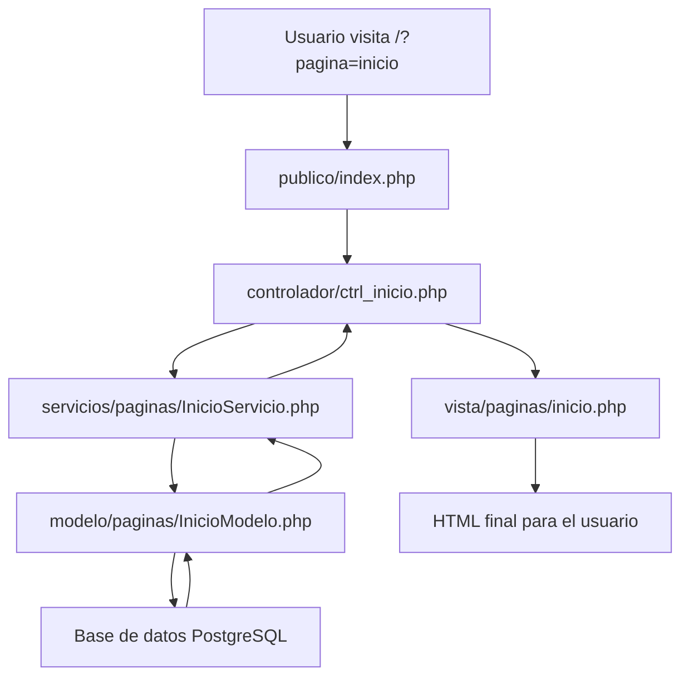

# Guía para Desarrolladores Principiantes - Portal UNEXCA

## Resumen Ejecutivo

Esta guía está diseñada para desarrolladores que están comenzando su carrera o tienen experiencia limitada con PHP y arquitecturas web. Utiliza el Portal UNEXCA como ejemplo práctico para explicar conceptos fundamentales de desarrollo web, desde lo más básico hasta implementaciones avanzadas.

## ¿Qué es PHP y Por Qué se Usa?

### ¿Qué es PHP?

**PHP** (PHP: Hypertext Preprocessor) es un lenguaje de programación especialmente diseñado para crear sitios web dinámicos. A diferencia de HTML que solo muestra contenido estático, PHP permite crear páginas que cambian según la información.

#### Ejemplo Básico de PHP
```php
<?php
// Esto es un comentario en PHP
echo "¡Hola, mundo!"; // Esto imprime texto en la página
?>
```

#### Comparación: HTML vs PHP
```html
<!-- HTML estático -->
<h1>Bienvenido a UNEXCA</h1>
<p>Esta página siempre muestra el mismo contenido</p>
```

```php
<?php
// PHP dinámico
$nombre = "Estudiante";
echo "<h1>Bienvenido a UNEXCA, " . $nombre . "</h1>";
echo "<p>Esta página puede mostrar contenido diferente</p>";
?>
```

### ¿Por Qué PHP para el Portal UNEXCA?

1. **Fácil de aprender**: Sintaxis similar a otros lenguajes
2. **Amplio soporte**: Funciona en la mayoría de servidores web
3. **Base de datos**: Excelente integración con PostgreSQL
4. **Flexibilidad**: Permite crear sitios complejos sin frameworks

## Conceptos Fundamentales de Desarrollo Web

### ¿Cómo Funciona un Sitio Web?

#### Proceso Básico
```
1. Usuario escribe URL → 2. Servidor recibe petición → 3. PHP procesa → 4. Base de datos consulta → 5. HTML generado → 6. Usuario ve página
```

#### Ejemplo Real del Portal UNEXCA
```php
// Cuando alguien visita: http://localhost/unexca/publico/?pagina=inicio

// 1. El servidor ejecuta publico/index.php
$pagina = $_GET['pagina'] ?? 'inicio'; // Obtiene 'inicio'

// 2. PHP decide qué hacer
if ($pagina === 'inicio') {
    // Cargar información de la página de inicio
    $carreras = obtenerCarreras();
    $noticias = obtenerNoticias();
}

// 3. Genera HTML dinámico
echo "<h1>Bienvenido a UNEXCA</h1>";
echo "<p>Tenemos " . count($carreras) . " carreras disponibles</p>";
```

### Variables en PHP

#### ¿Qué es una Variable?
Una variable es como una caja donde guardas información que puedes usar después.

```php
<?php
// Crear variables
$nombre = "UNEXCA";
$año = 2018;
$activa = true;

// Usar variables
echo "La universidad " . $nombre . " fue fundada en " . $año;
?>
```

#### Tipos de Variables
```php
<?php
// Texto (string)
$universidad = "UNEXCA";
$direccion = "Caracas, Venezuela";

// Números (integer)
$año_fundacion = 2018;
$numero_carreras = 9;

// Números decimales (float)
$promedio_notas = 15.5;

// Verdadero/Falso (boolean)
$universidad_activa = true;
$clases_suspendidas = false;

// Listas (array)
$carreras = ["Ingeniería", "Administración", "Contaduría"];
$nucleos = array("Altagracia", "Floresta", "Guaira", "Urbina");
?>
```

## Entendiendo la Arquitectura MVC-S

### ¿Qué es MVC-S?

**MVC-S** significa **Modelo-Vista-Controlador-Servicio**. Es una forma de organizar el código para que sea más fácil de entender y mantener.

#### Analogía del Restaurante
```
CLIENTE (Usuario) → MESERO (Controlador) → COCINERO (Servicio) → RECETA (Modelo) → PLATO (Vista)
```

### Componentes del MVC-S en el Portal UNEXCA

#### 1. **Modelo (Model)** - La Base de Datos
**¿Qué hace?** Se encarga de guardar y obtener información de la base de datos.

```php
// modelo/paginas/InicioModelo.php
class InicioModelo extends BaseModelo
{
    // Obtener todas las carreras de la base de datos
    public function obtenerCarrerasSimples()
    {
        return $this->obtenerTodos('carrera');
    }
}
```

**Ejemplo Práctico:**
```php
// Cuando necesitamos información de carreras
$modelo = new InicioModelo();
$carreras = $modelo->obtenerCarrerasSimples();
// $carreras ahora contiene: [["id" => 1, "titulo" => "Ingeniería"], ...]
```

#### 2. **Vista (View)** - Lo que Ve el Usuario
**¿Qué hace?** Muestra la información de forma bonita en el navegador.

```php
// vista/paginas/inicio.php
<section class="carreras">
    <h2>Programas Académicos</h2>
    <div class="carreras__lista">
        <?php foreach ($data_carrera as $carrera): ?>
            <div class="carrera">
                <h3><?= $carrera['titulo'] ?></h3>
                <p><?= $carrera['descripcion'] ?></p>
            </div>
        <?php endforeach; ?>
    </div>
</section>
```

**¿Qué hace este código?**
1. Crea una sección para mostrar carreras
2. Recorre cada carrera en `$data_carrera`
3. Para cada carrera, muestra el título y descripción

#### 3. **Controlador (Controller)** - El Coordinador
**¿Qué hace?** Recibe la petición del usuario y coordina qué información necesita.

```php
// controlador/ctrl_inicio.php
require_once colocar_ruta_sistema('@servicios/paginas/InicioServicio.php');

$servicio = new InicioServicio();
$data_carrera = $servicio->obtenerDatosCarreras();
```

**¿Qué hace este código?**
1. Carga el servicio de inicio
2. Pide al servicio que obtenga datos de carreras
3. Los datos quedan listos para la vista

#### 4. **Servicio (Service)** - El Procesador
**¿Qué hace?** Toma la información de la base de datos y la prepara para mostrar.

```php
// servicios/paginas/InicioServicio.php
class InicioServicio
{
    public function obtenerDatosCarreras()
    {
        // 1. Obtener datos de la base de datos
        $carreras_lista = $this->modelo_inicio->obtenerCarrerasSimples();
        
        // 2. Procesar cada carrera
        $carreras_array = [];
        foreach ($carreras_lista as $carrera) {
            // 3. Crear enlace para cada carrera
            $link_carrera = colocar_enlace('carrera', ['nombre' => $carrera['slug']]);
            
            // 4. Organizar información
            $carreras_array[] = [
                "titulo" => $carrera['titulo'],
                "descripcion" => $carrera['descripcion'],
                "links" => $link_carrera,
                "img" => $carrera['imagen'],
            ];
        }
        
        return $carreras_array;
    }
}
```

### Flujo Completo: Ejemplo Real

#### Cuando alguien visita la página de inicio:



#### Paso a Paso con Código:

**1. El usuario visita la página**
```
URL: http://localhost/unexca/publico/?pagina=inicio
```

**2. El servidor ejecuta index.php**
```php
// publico/index.php
$pagina = $_GET['pagina'] ?? 'inicio'; // $pagina = 'inicio'
```

**3. Se carga el controlador**
```php
// controlador/ctrl_inicio.php
$servicio = new InicioServicio();
$data_carrera = $servicio->obtenerDatosCarreras();
```

**4. El servicio procesa los datos**
```php
// servicios/paginas/InicioServicio.php
$carreras_lista = $this->modelo_inicio->obtenerCarrerasSimples();
// $carreras_lista = [["id" => 1, "titulo" => "Ingeniería", ...], ...]
```

**5. El modelo consulta la base de datos**
```php
// modelo/paginas/InicioModelo.php
return $this->obtenerTodos('carrera');
// Ejecuta: SELECT * FROM carrera
```

**6. La vista muestra la información**
```php
// vista/paginas/inicio.php
<?php foreach ($data_carrera as $carrera): ?>
    <div class="carrera">
        <h3><?= $carrera['titulo'] ?></h3>
        <p><?= $carrera['descripcion'] ?></p>
    </div>
<?php endforeach; ?>
```

## Trabajando con Base de Datos

### ¿Qué es una Base de Datos?

Una base de datos es como un archivo gigante muy organizado donde se guarda toda la información del sitio web.

#### Analogía de la Biblioteca
```
Base de Datos = Biblioteca completa
Tabla = Estante específico (ej: "Estante de Carreras")
Registro = Libro individual (ej: "Libro de Ingeniería")
Campo = Información del libro (ej: "Título", "Autor", "Páginas")
```

### Tablas en el Portal UNEXCA

#### Tabla `carrera`
```sql
-- Estructura de la tabla carrera
CREATE TABLE carrera (
  id SERIAL PRIMARY KEY,           -- Número único de cada carrera
  titulo VARCHAR(255) NOT NULL,    -- Nombre de la carrera
  descripcion TEXT,                -- Descripción de la carrera
  imagen VARCHAR(500)              -- Ruta de la imagen
);
```

#### Datos de Ejemplo
```sql
-- Datos en la tabla carrera
INSERT INTO carrera (titulo, descripcion, imagen) VALUES 
('Ingeniería en Informática', 'Programa de formación en desarrollo de software', 'ing-informatica.jpg'),
('Administración', 'Programa de formación en gestión empresarial', 'administracion.jpg');
```

### Consultas Básicas

#### Obtener Todas las Carreras
```php
// En el modelo
public function obtenerCarrerasSimples()
{
    return $this->obtenerTodos('carrera');
    // Equivale a: SELECT * FROM carrera
}
```

#### Obtener una Carrera Específica
```php
// En el modelo
public function obtenerCarreraPorId($id)
{
    return $this->obtenerPorId('carrera', $id);
    // Equivale a: SELECT * FROM carrera WHERE id = $id
}
```

#### Buscar Carreras por Nombre
```php
// En el modelo
public function buscarCarrerasPorNombre($nombre)
{
    $sql = "SELECT * FROM carrera WHERE titulo ILIKE :nombre";
    return $this->ejecutarConsultaPersonalizada($sql, ['nombre' => "%$nombre%"]);
    // Equivale a: SELECT * FROM carrera WHERE titulo LIKE '%$nombre%'
}
```

## Sistema de Archivos del Portal

### Estructura de Carpetas

```
UNEXCA-WEBSITE---PHP/
├── publico/                    # Lo que ve el usuario
│   ├── index.php              # Punto de entrada
│   ├── estilos/               # CSS
│   ├── scripts/               # JavaScript
│   └── imagenes/              # Imágenes
├── controlador/                # Controladores
├── modelo/                    # Modelos
├── servicios/                  # Servicios
├── vista/                     # Vistas
└── docs/                      # Documentación
```

### ¿Por Qué Esta Estructura?

#### Separación de Responsabilidades
```
publico/     → Solo archivos que el usuario puede ver
controlador/ → Lógica de coordinación
modelo/      → Acceso a datos
servicios/   → Procesamiento de información
vista/       → Presentación
```

#### Ejemplo Práctico
```php
// Cuando alguien visita una página de carrera:

// 1. publico/index.php (punto de entrada)
$pagina = $_GET['pagina']; // 'carrera'

// 2. controlador/ctrl_carrera.php (coordinador)
$servicio = new CarrerasServicio();
$data = $servicio->obtenerDatosCarrera($slug);

// 3. servicios/paginas/CarrerasServicio.php (procesador)
$carrera = $this->modelo->obtenerCarreraPorSlug($slug);

// 4. modelo/paginas/CarrerasModelo.php (base de datos)
return $this->obtenerPorId('carrera', $id);

// 5. vista/paginas/carrera.php (presentación)
echo "<h1>" . $data['titulo'] . "</h1>";
```

## Conceptos de Frontend

### ¿Qué es HTML?

**HTML** es el esqueleto de una página web. Define la estructura y el contenido.

```html
<!-- Estructura básica de una página -->
<!DOCTYPE html>
<html>
<head>
    <title>UNEXCA - Inicio</title>
</head>
<body>
    <header>
        <h1>Universidad UNEXCA</h1>
    </header>
    <main>
        <section>
            <h2>Nuestras Carreras</h2>
            <p>Ofrecemos programas de calidad</p>
        </section>
    </main>
</body>
</html>
```

### ¿Qué es CSS?

**CSS** es la ropa de la página web. Define cómo se ve todo.

```css
/* Estilos para el header */
header {
    background-color: #022873;  /* Color azul de UNEXCA */
    color: white;
    padding: 1rem;
}

h1 {
    font-size: 2rem;
    font-weight: bold;
}

/* Estilos para las secciones */
section {
    margin: 2rem 0;
    padding: 1rem;
    border-left: 3px solid #022873;
}
```

### ¿Qué es JavaScript?

**JavaScript** hace que la página sea interactiva. Permite que las cosas cambien sin recargar la página.

```javascript
// Ejemplo: Menú móvil
class Header {
    constructor() {
        this.boton = document.querySelector('.header__boton-menu');
        this.menu = document.querySelector('.header__nav');
        
        // Cuando se hace clic en el botón
        this.boton.addEventListener('click', () => {
            this.menu.classList.toggle('activo');
        });
    }
}

// Iniciar cuando la página esté lista
new Header();
```

## Trabajando con el Código del Portal

### Cómo Agregar una Nueva Página

#### Paso 1: Crear el Controlador
```php
<?php
// controlador/ctrl_nueva_pagina.php
require_once colocar_ruta_sistema('@servicios/paginas/NuevaPaginaServicio.php');

$servicio = new NuevaPaginaServicio();
$data = $servicio->obtenerDatos();

$head_data = [
    "title" => "Nueva Página - UNEXCA",
    "styles" => ["@estilos/paginas/nueva_pagina.css"]
];
?>
```

#### Paso 2: Crear el Servicio
```php
<?php
// servicios/paginas/NuevaPaginaServicio.php
require_once colocar_ruta_sistema('@modelo/paginas/NuevaPaginaModelo.php');

class NuevaPaginaServicio
{
    private $modelo;

    public function __construct()
    {
        $this->modelo = new NuevaPaginaModelo();
    }

    public function obtenerDatos()
    {
        // Obtener datos de la base de datos
        $datos = $this->modelo->obtenerTodosLosDatos();
        
        // Procesar los datos
        $resultado = [];
        foreach ($datos as $item) {
            $resultado[] = [
                'titulo' => $item['titulo'],
                'descripcion' => $item['descripcion'],
                'enlace' => colocar_enlace('detalle', ['id' => $item['id']])
            ];
        }

        return $resultado;
    }
}
?>
```

#### Paso 3: Crear el Modelo
```php
<?php
// modelo/paginas/NuevaPaginaModelo.php
require_once colocar_ruta_sistema('@modelo/BaseModelo.php');

class NuevaPaginaModelo extends BaseModelo
{
    public function obtenerTodosLosDatos()
    {
        return $this->obtenerTodos('tabla_nombre');
    }
}
?>
```

#### Paso 4: Crear la Vista
```php
<?php
// vista/paginas/nueva_pagina.php
?>
<main class="main__nueva-pagina">
    <section class="nueva-pagina__contenido">
        <h1>Nueva Página</h1>
        
        <?php if (!empty($data)): ?>
            <div class="nueva-pagina__lista">
                <?php foreach ($data as $item): ?>
                    <div class="nueva-pagina__item">
                        <h2><?= htmlspecialchars($item['titulo']) ?></h2>
                        <p><?= htmlspecialchars($item['descripcion']) ?></p>
                        <a href="<?= $item['enlace'] ?>" class="boton">
                            Ver más
                        </a>
                    </div>
                <?php endforeach; ?>
            </div>
        <?php else: ?>
            <p>No hay datos disponibles.</p>
        <?php endif; ?>
    </section>
</main>
```

#### Paso 5: Permitir la Página
```php
<?php
// servicios/paginas_permitidas.php
return $paginas_permitidas = [
    'inicio' => 'inicio.php',
    'historia' => 'historia.php',
    'nueva-pagina' => 'nueva_pagina.php', // ← Agregar aquí
];
?>
```

### Cómo Modificar una Página Existente

#### Ejemplo: Agregar Información a la Página de Inicio

**1. Modificar el Servicio**
```php
// servicios/paginas/InicioServicio.php
class InicioServicio
{
    // Método existente
    public function obtenerDatosCarreras()
    {
        // ... código existente
    }

    // Nuevo método
    public function obtenerDatosNuevos()
    {
        $datos = $this->modelo_inicio->obtenerNuevosDatos();
        
        $resultado = [];
        foreach ($datos as $item) {
            $resultado[] = [
                'campo1' => $item['campo1'],
                'campo2' => $item['campo2'],
                'enlace' => colocar_enlace('detalle', ['id' => $item['id']])
            ];
        }

        return $resultado;
    }
}
```

**2. Modificar el Controlador**
```php
// controlador/ctrl_inicio.php
$servicio = new InicioServicio();

$data_carrera = $servicio->obtenerDatosCarreras();
$data_nuevos = $servicio->obtenerDatosNuevos(); // ← Agregar esta línea
```

**3. Modificar la Vista**
```php
// vista/paginas/inicio.php
<section class="nuevos-datos">
    <h2>Nueva Información</h2>
    <?php foreach ($data_nuevos as $item): ?>
        <div class="nuevo-item">
            <h3><?= $item['campo1'] ?></h3>
            <p><?= $item['campo2'] ?></p>
        </div>
    <?php endforeach; ?>
</section>
```

## Conceptos de Seguridad

### ¿Por Qué es Importante la Seguridad?

Un sitio web sin seguridad es como una casa sin cerraduras. Cualquiera puede entrar y hacer daño.

#### Problemas Comunes
1. **Robo de información**: Alguien puede ver datos privados
2. **Modificación de contenido**: Alguien puede cambiar la página
3. **Ataques de spam**: El sitio puede ser usado para enviar correos no deseados

### Medidas de Seguridad en el Portal

#### 1. Validación de Entrada
```php
// ❌ MALO: Sin validación
$nombre = $_GET['nombre'];
echo "Hola " . $nombre;

// ✅ BUENO: Con validación
$nombre = filter_input(INPUT_GET, 'nombre', FILTER_SANITIZE_STRING);
$nombre = htmlspecialchars($nombre, ENT_QUOTES, 'UTF-8');
echo "Hola " . $nombre;
```

#### 2. Prepared Statements
```php
// ❌ MALO: Vulnerable a ataques
$sql = "SELECT * FROM carrera WHERE titulo = '" . $titulo . "'";

// ✅ BUENO: Seguro
$sql = "SELECT * FROM carrera WHERE titulo = :titulo";
$stmt = $pdo->prepare($sql);
$stmt->execute(['titulo' => $titulo]);
```

#### 3. Lista Blanca de Páginas
```php
// servicios/paginas_permitidas.php
return $paginas_permitidas = [
    'inicio' => 'inicio.php',
    'historia' => 'historia.php',
    // Solo páginas permitidas están en esta lista
];

// publico/index.php
if (!array_key_exists($pagina, $paginas_permitidas)) {
    http_response_code(404);
    die("Página no permitida");
}
```

## Herramientas de Desarrollo

### Editores de Código Recomendados

#### Visual Studio Code (Gratuito)
- **Extensiones útiles**:
  - PHP Intelephense (autocompletado)
  - Prettier (formato de código)
  - GitLens (control de versiones)

#### Configuración Básica
```json
{
    "editor.formatOnSave": true,
    "editor.tabSize": 4,
    "files.associations": {
        "*.php": "php"
    }
}
```

### Navegador para Desarrollo

#### Herramientas de Desarrollador
1. **F12** para abrir herramientas
2. **Console** para ver errores de JavaScript
3. **Network** para ver peticiones al servidor
4. **Elements** para inspeccionar HTML/CSS

### Control de Versiones con Git

#### Comandos Básicos
```bash
# Ver estado del proyecto
git status

# Agregar archivos
git add archivo.php

# Guardar cambios
git commit -m "Descripción del cambio"

# Enviar cambios
git push origin main
```

## Debugging y Resolución de Problemas

### Errores Comunes

#### Error: "Página no encontrada"
```php
// Verificar que la página esté en paginas_permitidas.php
return $paginas_permitidas = [
    'mi-pagina' => 'mi_pagina.php', // ← Debe estar aquí
];
```

#### Error: "Variable no definida"
```php
// ❌ MALO
echo $variable_no_definida;

// ✅ BUENO
$variable = $variable_no_definida ?? 'valor por defecto';
echo $variable;
```

#### Error: "No se puede conectar a la base de datos"
```php
// Verificar configuración en .env
DB_HOST=localhost
DB_PORT=5432
DB_NAME=unexca_dev
DB_USER=unexca_user
DB_PASS=unexca_password
```

### Herramientas de Debugging

#### Mostrar Errores en PHP
```php
// Al inicio del archivo
error_reporting(E_ALL);
ini_set('display_errors', 1);

// Para debug
var_dump($variable);
print_r($array);
```

#### Logs de Error
```php
// Escribir en log
error_log("Debug: " . print_r($variable, true));
```

## Mejores Prácticas

### Código Limpio

#### Nombres Descriptivos
```php
// ❌ MALO
$d = $s->g();

// ✅ BUENO
$datos = $servicio->obtenerDatos();
```

#### Comentarios Útiles
```php
// Obtener todas las carreras de la base de datos
$carreras = $modelo->obtenerCarrerasSimples();

// Procesar cada carrera para crear enlaces
foreach ($carreras as $carrera) {
    // Crear enlace dinámico para cada carrera
    $enlace = colocar_enlace('carrera', ['nombre' => $carrera['slug']]);
}
```

### Organización del Código

#### Separar Responsabilidades
```php
// ❌ MALO: Todo en un archivo
// controlador/ctrl_inicio.php
$pdo = new PDO(...);
$sql = "SELECT * FROM carrera";
$stmt = $pdo->prepare($sql);
$stmt->execute();
$carreras = $stmt->fetchAll();

foreach ($carreras as $carrera) {
    echo "<h3>" . $carrera['titulo'] . "</h3>";
}

// ✅ BUENO: Separado por responsabilidades
// controlador/ctrl_inicio.php
$servicio = new InicioServicio();
$data_carrera = $servicio->obtenerDatosCarreras();

// servicios/paginas/InicioServicio.php
public function obtenerDatosCarreras() {
    $carreras = $this->modelo->obtenerCarrerasSimples();
    // procesar datos...
}

// modelo/paginas/InicioModelo.php
public function obtenerCarrerasSimples() {
    return $this->obtenerTodos('carrera');
}

// vista/paginas/inicio.php
<?php foreach ($data_carrera as $carrera): ?>
    <h3><?= $carrera['titulo'] ?></h3>
<?php endforeach; ?>
```

## Próximos Pasos

### Aprendizaje Continuo

#### Recursos Recomendados
1. **Documentación PHP**: https://www.php.net/manual/
2. **PostgreSQL**: https://www.postgresql.org/docs/
3. **HTML/CSS**: https://developer.mozilla.org/
4. **JavaScript**: https://developer.mozilla.org/en-US/docs/Web/JavaScript

#### Proyectos Prácticos
1. **Crear una página nueva** siguiendo los ejemplos
2. **Modificar una página existente** para agregar funcionalidad
3. **Experimentar con la base de datos** agregando nuevos datos
4. **Personalizar el diseño** modificando CSS

### Contribuir al Proyecto

#### Cómo Contribuir
1. **Fork** el repositorio en GitHub
2. **Crear una rama** para tu funcionalidad
3. **Hacer cambios** siguiendo las mejores prácticas
4. **Probar** que todo funcione correctamente
5. **Crear un Pull Request** con descripción de cambios

#### Estándares de Código
- **Nombres descriptivos** para variables y funciones
- **Comentarios** explicando código complejo
- **Indentación consistente** (4 espacios)
- **Validación** de entrada de usuario
- **Manejo de errores** apropiado

## Conclusión

Esta guía te ha introducido a los conceptos fundamentales del desarrollo web usando el Portal UNEXCA como ejemplo práctico. Has aprendido:

- **Qué es PHP** y por qué se usa
- **Cómo funciona MVC-S** con ejemplos reales
- **Conceptos de base de datos** y consultas
- **Estructura del proyecto** y organización
- **Frontend básico** (HTML, CSS, JavaScript)
- **Seguridad** y mejores prácticas
- **Herramientas de desarrollo** y debugging

### Recuerda:
- **La práctica hace al maestro**: Experimenta con el código
- **No tengas miedo de romper cosas**: Siempre puedes restaurar
- **Pregunta cuando tengas dudas**: La comunidad está para ayudar
- **Mantén el código limpio**: Es más fácil de mantener

¡Ahora estás listo para comenzar tu journey como desarrollador web con el Portal UNEXCA como tu laboratorio de aprendizaje!
